# Implementing Detailed Metrics Alarms, Alerting, and Dashboards for Amazon EC2

## Prerequisite
- AWS account

## Installing a CloudWatch Agent on EC2 instance
### Steps
- Log in to [AWS console](https://aws.amazon.com/console/).
- Navigate to **EC2** service by using search bar.

    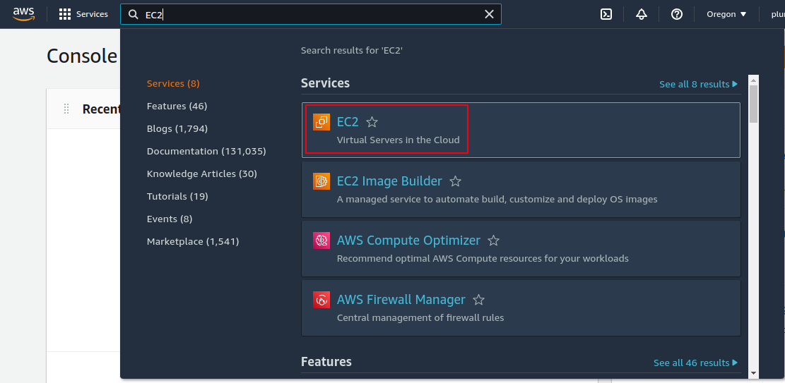

- We need an EC2 instance in running state to proceed forward.
    - If you don't have EC2 instance created, create one. [AWS Elastic Cloud Compute](https://kubesimplify.com/aws-elastic-cloud-compute) is a blog, showing how to create a EC2 instance.
    - If you have an EC2 instance, proceed with next steps.

- Navigate to your instance

    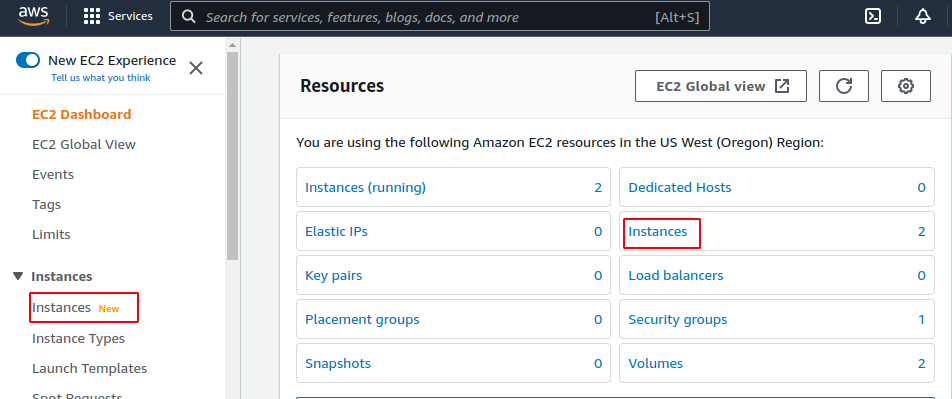

- Now you will see your instance, select your instance and click on **connect**.

    

- Connect to your EC2 instance, using any one method as shown below.
    

- Download and configure **CloudWatch** agent for your selected operating system running in your EC2 instance from [here](https://docs.aws.amazon.com/AmazonCloudWatch/latest/monitoring/download-cloudwatch-agent-commandline.html).

- Create a **CloudWatch** configuration file for your EC2 instance. Refer [documentation](https://docs.aws.amazon.com/AmazonCloudWatch/latest/monitoring/create-cloudwatch-agent-configuration-file-wizard.html#cloudwatch-agent-running-wizard) for creating configuration file.

- **Amazon CloudWatch Agent Configuration Manager** will prompt with below questions, choose the options per your configuration and requirement.

    1. On which OS are you planning to use the agent?
    2. Are you using EC2 or On-Premises hosts?
    3. Which user are you planning to run the agent? - choose **cwagent**.
    4. Do you want to turn on StatsD daemon? - My choice **No**
    5. Do you want to monitor metrics from CollectD? WARNING: CollectD must be installed or the Agent will fail to start - My choice **No**
    6. Do you want to monitor any host metrics? e.g. CPU, memory, etc. - Choose **Yes**
    7. Do you want to monitor cpu metrics per core? - Choose **Yes**
    8. Do you want to add ec2 dimensions (ImageId, InstanceId, InstanceType, AutoScalingGroupName) into all of your metrics if the info is available? - Choose **Yes**
    9.Do you want to aggregate ec2 dimensions (InstanceId)? - Choose **Yes**
    10. Would you like to collect your metrics at high resolution (sub-minute resolution)? This enables sub-minute resolution for all metrics, but you can customize for specific metrics in the output json file.
    11. Which default metrics config do you want? - My choice **Standard**
    12. Are you satisfied with the above config? Note: it can be manually customized after the wizard completes to add additional items.
    13. Do you have any existing CloudWatch Log Agent (http://docs.aws.amazon.com/AmazonCloudWatch/latest/logs/AgentReference.html) configuration file to import for migration? - choose **No**
    14. Do you want to monitor any log files? - My choice **No**
    15. Do you want to store the config in the SSM parameter store? - Choose **No**

- Start **CloudWatch** agent. [Documentation for starting CloudWatch agent](https://docs.aws.amazon.com/AmazonCloudWatch/latest/monitoring/install-CloudWatch-Agent-on-EC2-Instance-fleet.html#start-CloudWatch-Agent-EC2-fleet).

## Configuring Metrics with Alarms
### Steps
- Navigate to **Cloudwatch** using search bar

    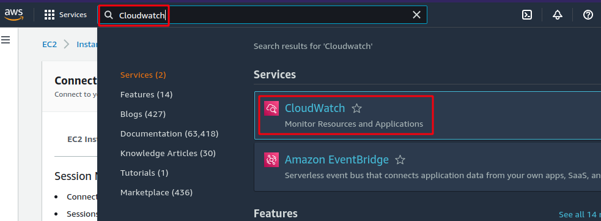

- Find and click on **Create Alarm**
- Creating an Alarm
    - Click on **Select Metric**

        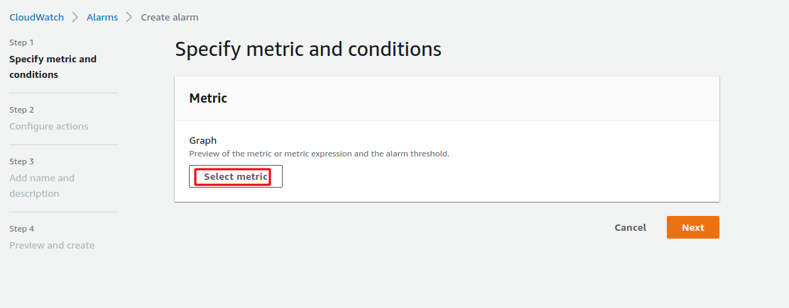

    - Under **Custom namespaces** select **CWAgent**

        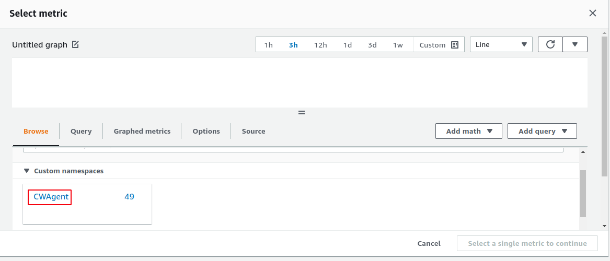

    - In **Browse** section, select a card as per your requirement and go through other section and modify per requirement.

        

    - Select appropriate EC2 configuration from displayed list.
    - Modify **Metric** and **Conditions** cards as per your requirement and click on **Next**.

    - In **Notification** card, select **Create new topic** and provide topic name, emails addresses for notifications. Click on **Create topic**. Click **Next**.

        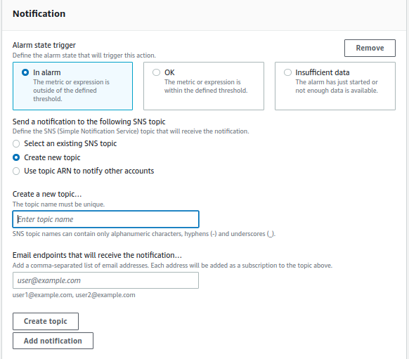

    - Enter Alarm name and description(optional).

        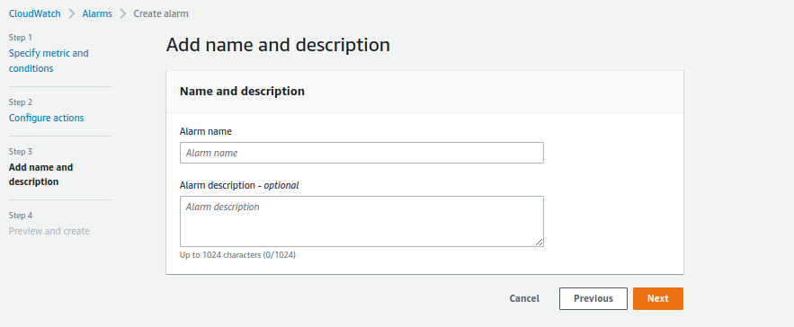

## Enabling an Email Notification with the SNS
### Steps
- Navigate to **SNS** using search bar

    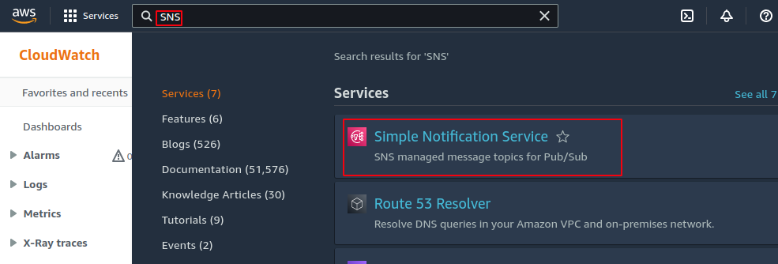

- From left hand pane, in **Dashboard** find and click **Subscriptions**.

    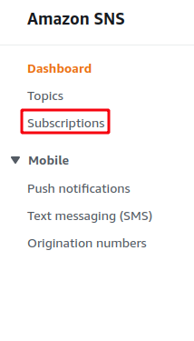

- You will be seeing **pending confirmation** in **ID**. Now open your provided email and Search for an email from **no-reply@sns.amazonaws.com** with subject line **AWS Notification - Subscription Confirmation**.  In that email click on **Confirm subscription**.

    - Before clicking **Confirm subscription** in mail. Screen in SNS.

        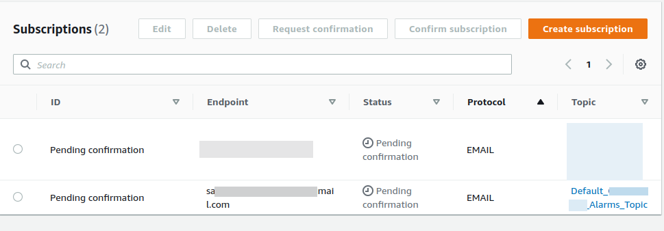
    
    - After clicking **Confirm subscription** in mail. Screen in SNS.

        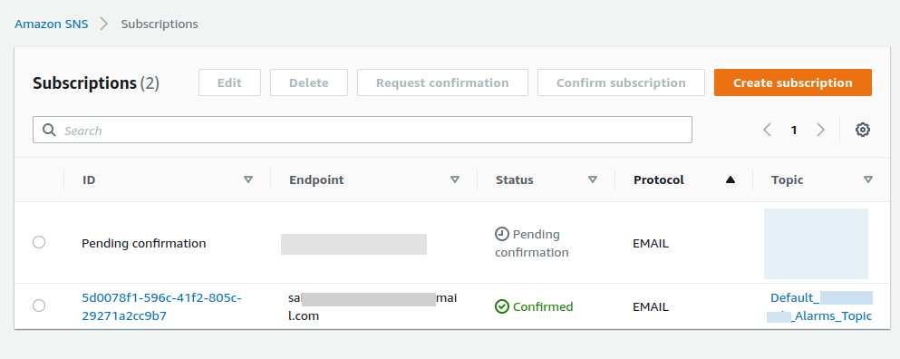

## Displaying Metrics in a Dashboard
### Steps
- Navigate to **Cloudwatch** using search bar

    

- Click on **Dashboard** from left pane and click on **Create dashboard**

    

- Provide dashboard name and click on **Create dashboard**

    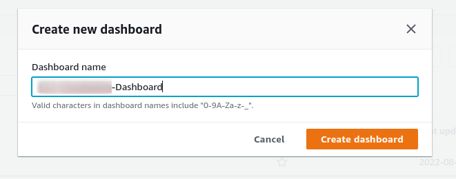

- **Add widget** screen will pops-up. Select your desired type of widget per requirement.
- When **Add to this dashboard** card displayed, click on **Metrics**.
- Select **CWAgent** under **Custom namespaces**.
- In **Browse** section, select a card as per your requirement and go through other section and modify per requirement.

    

- Select appropriate EC2 configuration from displayed list.
- Modify other options if required and click on **Create widget**.
- Create widgets per your requirement by clicking on **Add widget**.
- After creating desired no. of widgets, finally click on **Save dashboard**.

**Viola, reached end of the guide for Implementing Detailed Metrics Alarms, Alerting, and Dashboards for Amazon EC2 is completed.**

**Happy Learning :)**
